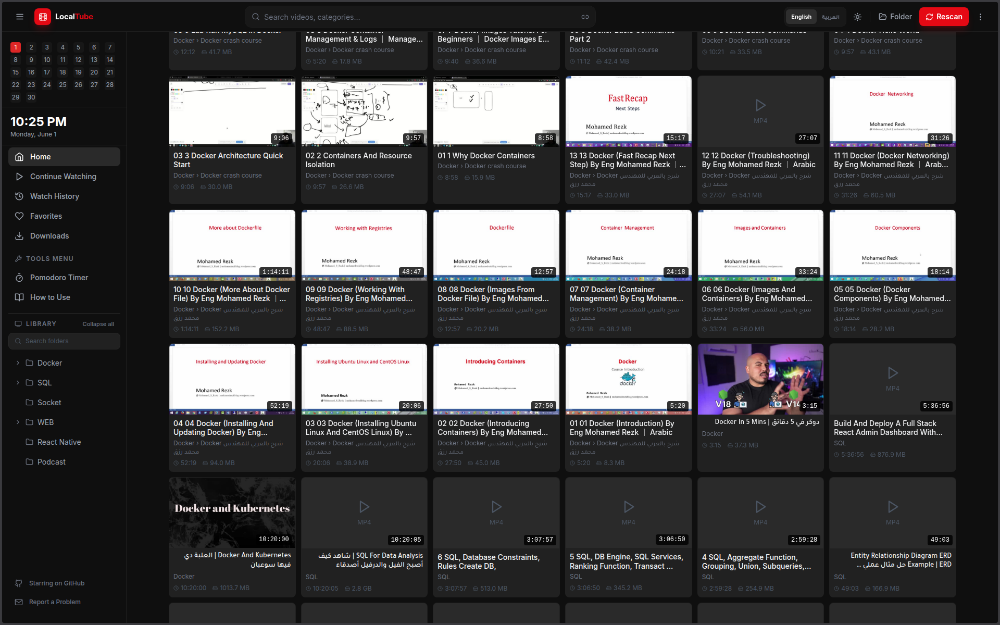
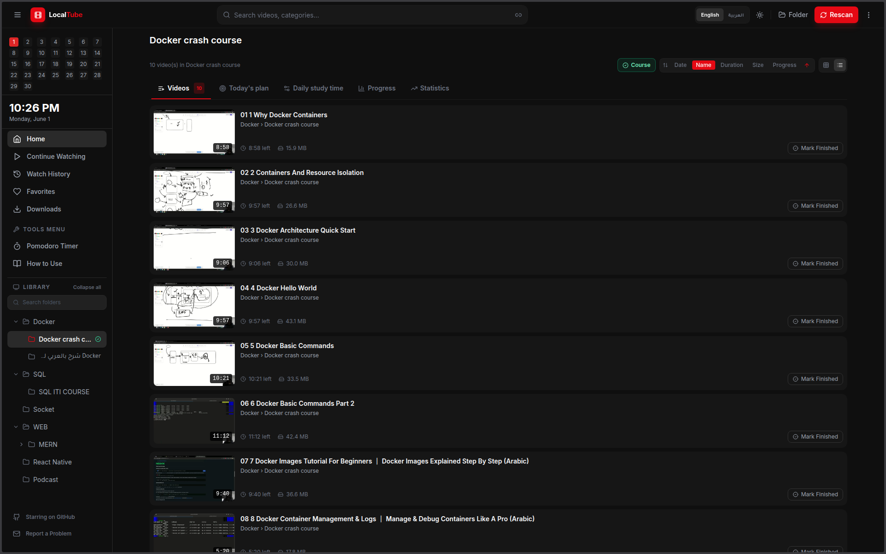
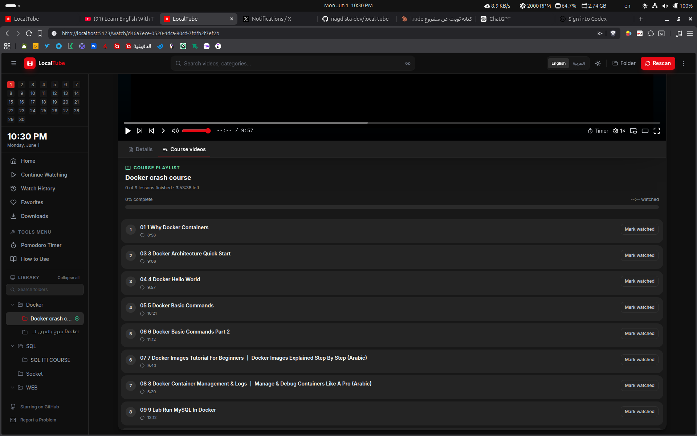
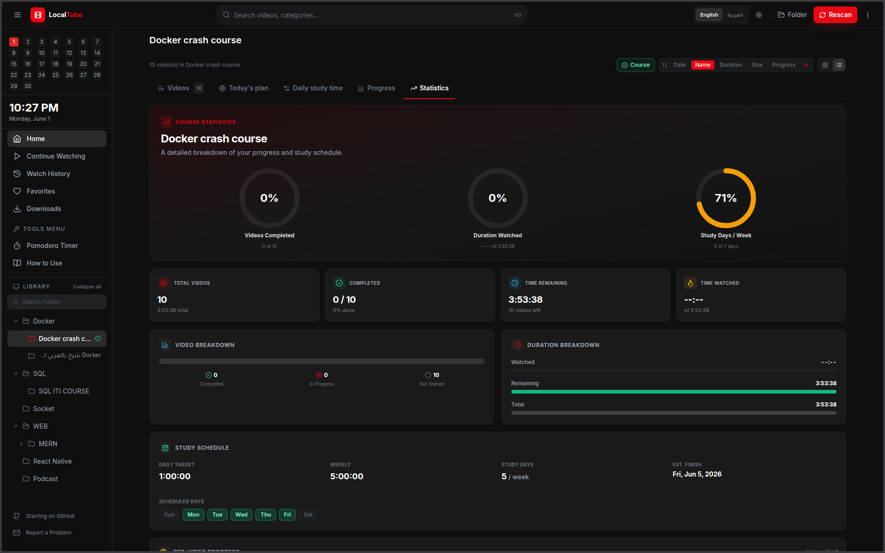
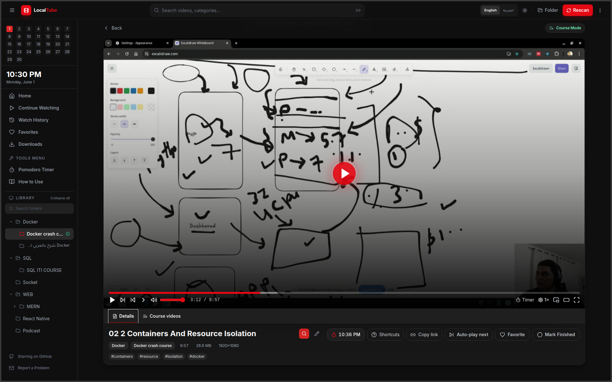

# LocalTube

LocalTube is a self-hosted video library for watching, organizing, and studying from videos stored on your own computer. It gives a YouTube-style browsing and player experience while keeping your files, watch history, favorites, course progress, and Pomodoro tasks local.



## What This Project Does

LocalTube scans a local folder of video files, stores their metadata in SQLite, generates thumbnails with FFmpeg, and serves them through a React web app. The app is designed for personal media libraries, downloaded lessons, course folders, and focused study workflows.

The project includes:

- A React + TypeScript frontend built with Vite.
- An Express + TypeScript backend API.
- A local SQLite database powered by `better-sqlite3`.
- Local video streaming with HTTP range support for seeking.
- Folder-based categories and nested course organization.
- Favorites, watch history, continue watching, search, sorting, and progress tracking.
- Course mode with study planning and course statistics.
- Pomodoro timer with saved settings and tasks.
- Optional online video download support through `yt-dlp`.
- Optional YouTube metadata/comments support through `YOUTUBE_API_KEY`.
- English and Arabic UI translations.

## Screenshots

### Home Library

The home screen shows the scanned library, folder navigation, search, sorting, progress, favorites, and quick access to common library areas.


### Course View

Folders can be marked as courses. Course mode adds study planning, completion tracking, watched time, remaining time, and per-lesson progress.



### Course Videos

The course videos screen shows the lessons inside a marked course folder with progress, completion status, and quick access to each video.



### Course Statistics

Course statistics summarize study progress so you can see completed videos, remaining videos, watched duration, and remaining duration.



### Video Player

The video player streams local files in the browser, supports seeking through range requests, and saves watch progress automatically.



## Main Features

### Local Video Library

LocalTube reads videos from a folder on your machine. It recursively scans subfolders and creates a searchable catalog. Supported file extensions are:

- `.mp4`
- `.mkv`
- `.avi`
- `.mov`
- `.webm`
- `.m4v`
- `.flv`

The scanner derives categories from your folder structure. For example:

```text
Videos/
|-- Courses/
|   `-- React Basics/
|       |-- 01 - Introduction.mp4
|       `-- 02 - Components.mp4
|-- Movies/
|   `-- Example Film.mkv
`-- Tutorials/
    `-- TypeScript/
        `-- Generics.webm
```

In this layout, `Courses`, `Movies`, and `Tutorials` become top-level categories. Nested folders become subcategories and course sections.

### Browser Video Player

The backend streams videos through `/api/stream/:id` using HTTP range requests. This allows the browser video player to seek inside large files without downloading the whole file first.

The player saves watch progress to SQLite, so you can leave a video and continue later. Finished videos can be marked complete, and progress can be cleared when needed.

### Watch History and Continue Watching

LocalTube stores the last watched position for each video. The app uses that data to show:

- Recently watched videos.
- Continue watching items.
- Progress bars on video cards.
- Completed or partially completed course lessons.

### Favorites

Any video can be marked as a favorite. Favorites are stored in the database and shown on the dedicated Favorites page.

### Search and Sorting

The library can be searched by title, category, subcategory, and generated tags. Sorting options include:

- Newest or oldest.
- Name ascending or descending.
- Duration ascending or descending.
- File size ascending or descending.
- Watch progress ascending or descending.

### Course Mode

Any folder can be marked as a course. When a folder is a course, LocalTube can show course-focused tools:

- Total course duration.
- Watched duration.
- Remaining duration.
- Completed videos.
- Remaining videos.
- Study plan settings.
- Per-task lesson checks.

Study plan data is saved in SQLite, so course progress persists between app restarts.

### Pomodoro Timer

The Pomodoro page helps organize focused study sessions. It stores:

- Work session length.
- Short break length.
- Long break length.
- Number of cycles before a long break.
- Pomodoro tasks.
- Completed cycle counts.

All Pomodoro settings and tasks are local and saved in the same SQLite database.

### Downloads

LocalTube can start video downloads from URLs if `yt-dlp` is installed on your system. Downloads are saved into a `Downloads` folder inside the configured video library root. After a download finishes, the server catalogs the new file and queues thumbnail generation.

This feature depends on external tools:

- `yt-dlp` for downloading.
- `FFmpeg` for probing video metadata and creating thumbnails.

### YouTube Metadata

The backend includes an optional route for loading YouTube video details and comments:

```text
GET /api/videos/youtube/:videoId
```

To enable this, set `YOUTUBE_API_KEY` in the server environment. Without the key, the app still works, but YouTube metadata and comments are unavailable.

## Tech Stack

### Frontend

- React 18
- TypeScript
- Vite
- React Router
- TanStack React Query
- Zustand
- Tailwind CSS
- Lucide React icons

### Backend

- Node.js
- Express
- TypeScript
- SQLite with `better-sqlite3`
- FFmpeg through `fluent-ffmpeg`
- `yt-dlp` through a child process for optional downloads

## Project Structure

```text
local-tube/
|-- assets/                 # README screenshots
|   |-- Home.png
|   |-- Course.png
|   |-- CourseVideos.png
|   |-- VideoPlayer.png
|   `-- Statics.png
|-- client/                 # React frontend
|   |-- public/
|   `-- src/
|       |-- components/     # Shared UI components
|       |-- hooks/          # React hooks
|       |-- i18n/           # English and Arabic translations
|       |-- pages/          # App pages
|       |-- store/          # Zustand state
|       |-- types/          # Frontend TypeScript types
|       `-- utils/          # API, formatting, sorting, study plan helpers
|-- server/                 # Express backend
|   `-- src/
|       |-- routes/         # API routes
|       |-- services/       # Database, scanner, thumbnails, downloads
|       `-- types/          # Backend TypeScript types
|-- cache/                  # Generated local config and SQLite database
|-- thumbnails/             # Generated video thumbnails
|-- package.json            # Workspace scripts
`-- README.md
```

`cache/` and `thumbnails/` are generated at runtime. They do not need to exist before starting the app.

## Requirements

Install these before running the project:

- Node.js 20 or newer. Node.js 22 is recommended.
- npm.
- FFmpeg, required for video metadata and thumbnails.

Optional:

- `yt-dlp`, required only for the Downloads page.
- A YouTube Data API key, required only for YouTube metadata/comments.

## Installation

Clone the repository and install all workspace dependencies:

```bash
git clone https://github.com/nagdista-dev/local-tube.git
cd local-tube
npm install
```

The root project uses npm workspaces for `client` and `server`, so `npm install` from the root installs dependencies for both apps.

## Running in Development

Start the backend and frontend together:

```bash
npm run dev
```

Development URLs:

- Frontend: `http://localhost:5173`
- Backend API: `http://localhost:3001`
- Health check: `http://localhost:3001/api/health`

The root `dev` command runs:

```bash
npm run dev --workspace=server
npm run dev --workspace=client
```

The server auto-scans the configured library on startup unless `AUTO_SCAN=false` is set.

## First-Time Setup

1. Start the app with `npm run dev`.
2. Open `http://localhost:5173`.
3. Choose or enter the folder that contains your videos.
4. Save the library location.
5. Start a scan.
6. Wait for the scan status to finish.
7. Browse, search, favorite, and watch your videos.

The selected library path is saved to:

```text
cache/library-config.json
```

If no location is saved, the server uses:

```text
$VIDEOS_DIR
```

or falls back to:

```text
$HOME/Videos
```

## Building for Production

Build both workspaces:

```bash
npm run build
```

Start the compiled backend:

```bash
npm run start
```

The root `start` script starts the server workspace:

```bash
npm run start --workspace=server
```

## Environment Variables

Create a `.env` file in the project root when you need custom configuration:

```bash
PORT=3001
CORS_ORIGIN=http://localhost:5173
VIDEOS_DIR=/absolute/path/to/videos
AUTO_SCAN=true
YOUTUBE_API_KEY=
```

Available variables:

- `PORT`: backend port. Default is `3001`.
- `CORS_ORIGIN`: allowed frontend origin. Default is `http://localhost:5173`.
- `VIDEOS_DIR`: fallback video library path.
- `AUTO_SCAN`: set to `false` to disable scan on server startup.
- `YOUTUBE_API_KEY`: optional YouTube Data API key.

## Database

LocalTube stores app data in:

```text
cache/library.db
```

The database contains:

- `videos`: scanned video metadata.
- `watch_history`: saved playback positions.
- `courses`: folders marked as courses.
- `course_study_plans`: course plan settings and task checks.
- `pomodoro_settings`: timer settings.
- `pomodoro_tasks`: Pomodoro task list and completed cycles.

SQLite runs in WAL mode for better local performance.

## API Overview

Main backend routes:

- `GET /api/health`: server status and active library path.
- `GET /api/videos`: paginated video list.
- `GET /api/videos/search?q=term`: search videos.
- `GET /api/videos/categories`: folder/category tree.
- `POST /api/videos/categories/course`: mark or unmark a folder as a course.
- `GET /api/videos/categories/:category/study-plan`: load a course study plan.
- `PUT /api/videos/categories/:category/study-plan`: save a course study plan.
- `GET /api/videos/history`: recently watched videos.
- `GET /api/videos/favorites`: favorite videos.
- `POST /api/videos/:id/favorite`: toggle favorite.
- `POST /api/videos/:id/progress`: save playback progress.
- `GET /api/videos/:id/progress`: read playback progress.
- `DELETE /api/videos/:id/progress`: clear playback progress.
- `POST /api/videos/:id/finished`: mark a video finished or unfinished.
- `GET /api/stream/:id`: stream a local video file.
- `POST /api/scan`: start a library scan.
- `GET /api/scan/status`: read scan progress.
- `GET /api/scan/location`: read saved library location.
- `POST /api/scan/location`: save library location.
- `GET /api/scan/directories`: list directories for folder selection.
- `POST /api/scan/clear-cache`: clear library cache.
- `GET /api/settings/pomodoro`: load Pomodoro settings.
- `POST /api/settings/pomodoro`: save Pomodoro settings.
- `GET /api/settings/pomodoro/tasks`: list Pomodoro tasks.
- `POST /api/settings/pomodoro/tasks`: create a Pomodoro task.
- `PUT /api/settings/pomodoro/tasks/:id`: update a Pomodoro task.
- `DELETE /api/settings/pomodoro/tasks/:id`: delete a Pomodoro task.
- `POST /api/settings/pomodoro/tasks/clear`: remove completed Pomodoro tasks.
- `POST /api/videos/download`: start a `yt-dlp` download job.
- `GET /api/videos/download/jobs/:jobId`: read download status.
- `POST /api/videos/external`: save an external stream link.
- `GET /api/videos/youtube/:videoId`: optional YouTube metadata and comments.

## How Scanning Works

The scanner:

1. Reads the configured video folder recursively.
2. Keeps only supported video extensions.
3. Compares files on disk with existing database paths.
4. Removes database records for deleted files.
5. Probes new files with FFmpeg.
6. Creates clean titles from filenames.
7. Generates simple tags from title and category words.
8. Saves video records in SQLite.
9. Queues thumbnail generation in the background.

The scanner processes new files in batches, so large libraries can be indexed without blocking the whole server.

## How Streaming Works

When the browser requests a video, the server:

1. Looks up the video by ID.
2. Checks that the file still exists on disk.
3. Detects its MIME type.
4. Reads the browser `Range` header.
5. Returns either the whole file or a `206 Partial Content` response.

This is what makes seeking inside large local videos work reliably.

## Troubleshooting

### The app starts but no videos appear

- Check that the selected library path is correct.
- Make sure the folder contains supported video formats.
- Start a new scan from the app.
- Check the backend console for scanner errors.

### Thumbnails are missing

- Install FFmpeg.
- Make sure `ffmpeg` is available in your terminal path.
- Rescan the library or clear the cache and scan again.

### Downloads fail

- Install `yt-dlp`.
- Make sure `yt-dlp` is available in your terminal path.
- Confirm the video URL is supported by `yt-dlp`.
- Check the download job error in the Downloads page or backend console.

### `better-sqlite3` fails to load

This usually means dependencies were installed with a different Node.js version than the one running the app. Rebuild or reinstall:

```bash
npm rebuild better-sqlite3
```

If that does not work, reinstall dependencies with the same Node.js version you use to run the app.

### The server uses the wrong library folder

Check:

```text
cache/library-config.json
```

You can change the folder in the app, or delete that config file and set `VIDEOS_DIR` in `.env`.

## Development Notes

The frontend entry point is:

```text
client/src/main.tsx
```

Main app routes are defined in:

```text
client/src/App.tsx
```

Backend routes are mounted in:

```text
server/src/index.ts
```

The database service is:

```text
server/src/services/database.ts
```

The scanner is:

```text
server/src/services/scanner.ts
```

The streaming route is:

```text
server/src/routes/stream.ts
```

When adding new features, keep frontend types in `client/src/types/` aligned with backend types in `server/src/types/`.

## Scripts

Root scripts:

```bash
npm run dev      # Start server and client in development mode
npm run build    # Build server and client
npm run start    # Start compiled server
```

Client scripts:

```bash
npm run dev --workspace=client
npm run build --workspace=client
npm run preview --workspace=client
```

Server scripts:

```bash
npm run dev --workspace=server
npm run build --workspace=server
npm run start --workspace=server
```

## Privacy

LocalTube is designed to run locally. Your local video files are not uploaded by the app. Metadata, watch history, favorites, course plans, and Pomodoro tasks are stored on your machine in SQLite.

External network access is only used when you choose features that require it, such as downloading from a URL with `yt-dlp` or loading YouTube metadata through a configured API key.

## License

This project is released under the MIT License.
